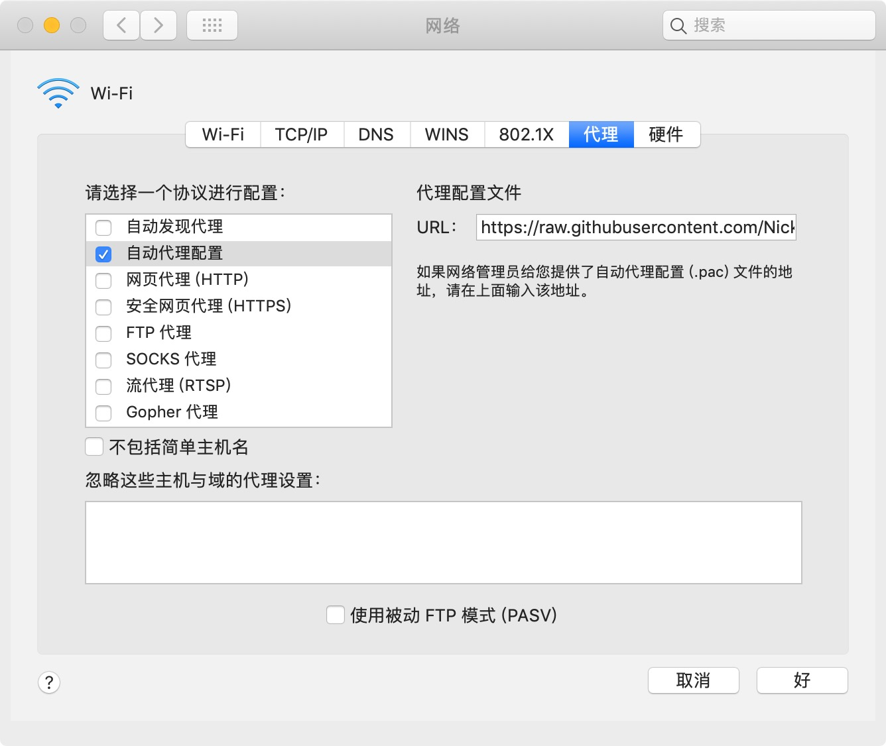

# 🚀 _Pac_for_Safari_

实现 Safari PAC 模式代理访问互联网

## 📍 ABSTRACT

Safari 没有开放代理 API，因为 macOS 可以很方便地设置系统级的全局代理，但是全局代理则会导致所有流量走代理服务器。

相比类似于 Chrome + SwitchyOmega (auto switch) 那种代理上网效果（国内正常，国外走代理），Safari 在代理上网方面的扩展程序实在乏善可陈，这个项目的所解决的需求就是在 macOS Safari 平台上实现 Chrome 的这种代理上网方式。

## 📍 为什么不直接用 Chrome？

不接电源时，Safari 要比 Chrome 更省电。

## 📍 方案一

### 1）导出 PAC 文件

从 Chrome 的 SwitchyOmega 扩展程序中将 PAC 文件导出，记得选择 auto switch 模式下的 PAC 文件。

### 2）将文件保存到 GitHub

新建一个库，将 PAC 代码存至 GitHub。

### 3）修改 hosts 文件

raw.githubusercontent.com 在国内被墙，会导致系统无法下载到 PAC 文件，所以需要修改 hosts 文件以防止 DNS 污染。首先查询 raw.githubusercontent.com 的真实 IP。

macOS 用户 `sudo vi /etc/hosts` 在 hosts 文件最后一行添加：

```
199.232.68.133 raw.githubusercontent.com
```

### 4）设置代理

系统偏好设置 👉🏻 网络 👉🏻 高级 👉🏻 代理 👉🏻 选择「自动代理配置」，URL 一栏填入打开 GitHub 仓库中点击 RAW 查看 PAC 文件时的 URL。



## 📍 方案二

在本机存放 PAC 的目录下用 python 直接起一个端口为 8909 的 HTTP 服务：

```python
python -m http.server 8909
```

代理设置中 url 填 `http://127.0.0.1:8909/fq.pac` 即可。